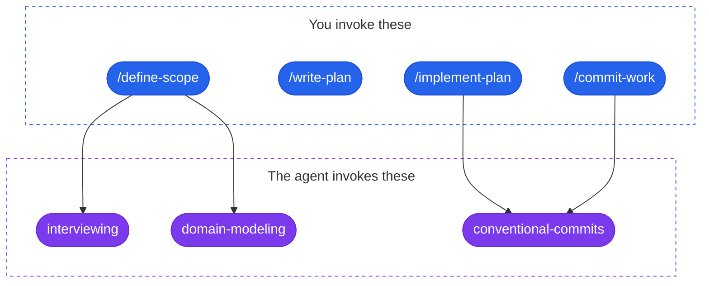

# skills

My skills for coding agents (Claude Code, Codex, Cursor).

## Install

```bash
npx skills@latest add javierscode/skills
```

## Main workflow

From an idea to a pull request, one skill per step:

1. **`/define-scope`** — settle every decision with you, writing the glossary and the ADRs along the way.
2. **`/write-plan`** — cut that scope into vertical slices, one file per task.
3. **`/implement-plan`** — run the slices as reviewed subagents into a single pull request.

## Skills

### You invoke these

Typed as `/name`. Nothing else can reach them, so this list is what you have to remember.

- **[commit-work](./skills/commit-work/)** — cuts your working tree into one commit per intent, shows you the proposal, and commits once you approve.
- **[define-scope](./skills/define-scope/)** — interviews you one question at a time until every decision is settled, writing the glossary and the ADRs as it goes.
- **[implement-plan](./skills/implement-plan/)** — runs a plan's slices as parallel subagents, each one reviewed before it merges, into a single pull request.
- **[write-plan](./skills/write-plan/)** — turns what you decided in the session into a plan of vertical slices, one file per task, written once you approve the breakdown.

### The agent invokes these

Reached on its own when the task fits, or by the skills above. You can type them too.

- **[conventional-commits](./skills/conventional-commits/)** — where a commit is cut and how its message reads, so any skill that ends in commits writes them the same way.
- **[domain-modeling](./skills/domain-modeling/)** — sharpens your project's vocabulary while you talk, writing the glossary and the ADRs under it the moment they settle.
- **[interviewing](./skills/interviewing/)** — the design-tree interview itself, behind `/define-scope`. Type `/interviewing` for the interview without the docs.

### How they compose



## License

MIT — see [LICENSE](./LICENSE).
